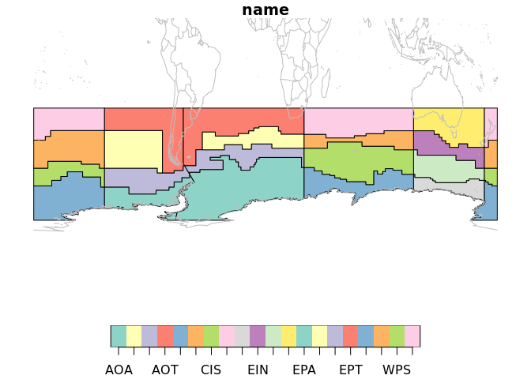
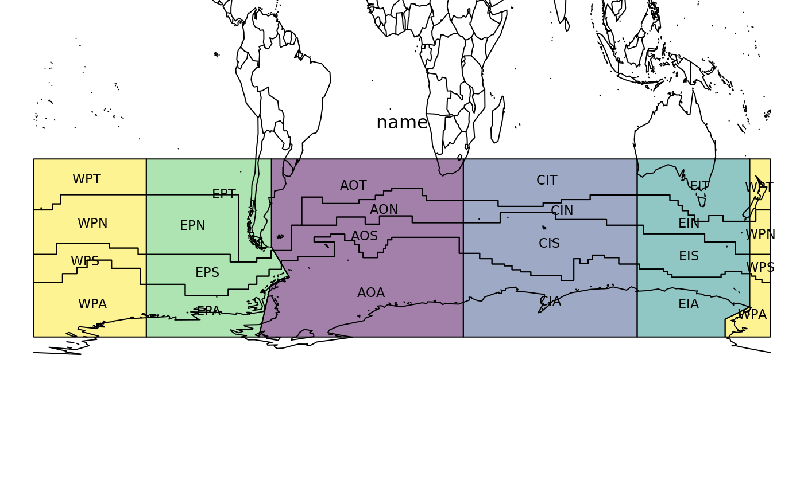
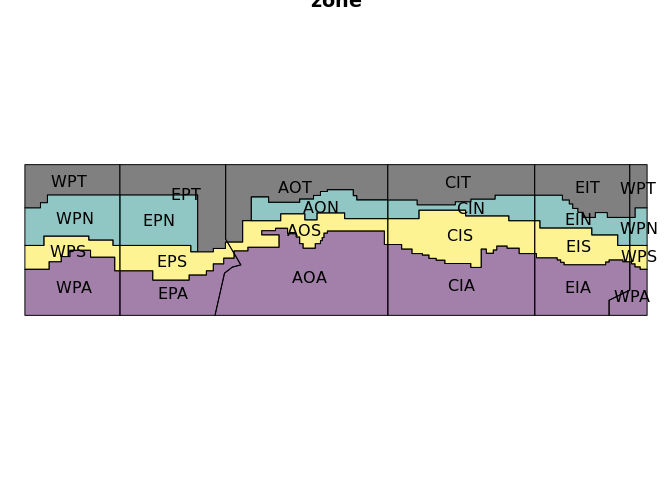
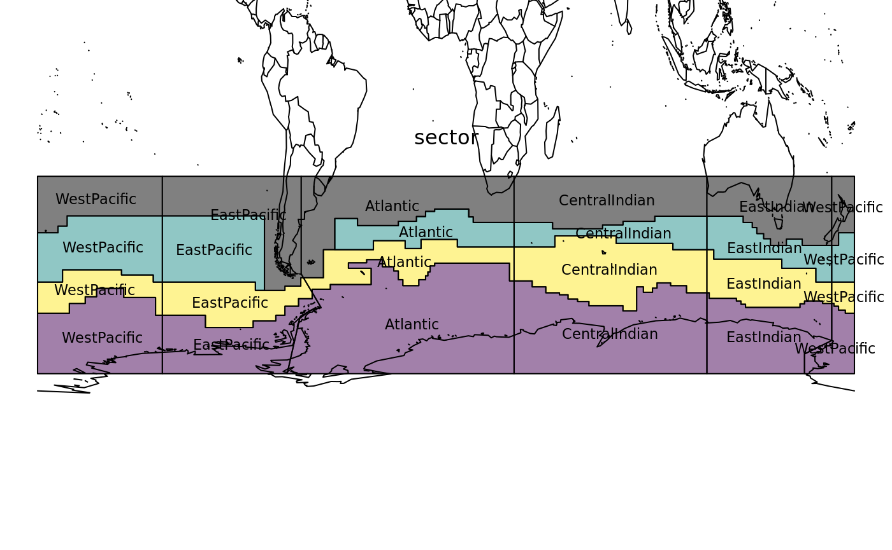

<!-- README.md is generated from README.Rmd. Please edit that file -->

# measoshapes

The goal of measoshapes is to provide regionalization boundaries for
MEASO.

There are several in-built data sets currently at **version 05**. See
below where each is explained.

## Installation

To install measoshapes from Github use

``` r
## install.packages("remotes")
remotes::install_github("AustralianAntarcticDivision/measoshapes")
```

## Data sets

There is no code in the measoshapes package, but the package records the
creation of each shapes layer using standard R mechanisms.

There are five datasets, and for normal usage, calculating areas, and
making maps we would use the first three. The `_coastline` forms have
the continent of Antarctica cut out of the shapes.

  - `measonames` a dataframe of the `name`, `sector`, and `zone`
  - `measo_regions05_ll_coastline` the polygons with the continent of
    Antarctica cut out
  - `measo_regions05_coastline` the polygons (in polar) with the
    continent of Antarctica cut out

Two other forms in polar and longitude/latitude form are use for model
overlays (for technical reasons).

  - `measo_regions05` the polygons of each combination of sector and
    zone
  - `measo_regions05_ll` the polygons in longitude/latitude form

To make a map with these we can use the following code

``` r
library(measoshapes)
#> Loading required package: sf
#> Linking to GEOS 3.7.0, GDAL 2.4.0, PROJ 5.2.0
plot(measo_regions05_ll_coastline, reset = FALSE)
maps::map(add = TRUE, col = "grey", fill = FALSE)
```



To export to shapefile:

``` r
st_write(measo_regions05_ll_coastline, "myfile.shp", driver = "SHP")
```

Here we explore the names in more detail. The northern regions are
assigned codes that include “T” for **temperate**, but they aren’t
supposed to be part of MEASO. They share a sector but have no assigned
zone. From `colour_values` on zone they get black.

``` r
par(mar = rep(0.2, 4))
plot(st_geometry(measo_regions05_ll), reset = FALSE, 
     col = colourvalues::colour_values(measo_names$sector, alpha = 0.5))
cds <- st_coordinates(st_centroid(measo_regions05_ll))
#> Warning in st_centroid.sfc(st_geometry(x), of_largest_polygon =
#> of_largest_polygon): st_centroid does not give correct centroids for
#> longitude/latitude data
text(cds, lab = measo_names$name, cex = 0.7)
par(xpd = NA)
text(0, -20, "name")
maps::map(add = TRUE)
```



``` r
par(xpd = TRUE)

plot(st_geometry(measo_regions05_ll), reset = FALSE, 
     col = colourvalues::colour_values(measo_names$zone, alpha = 0.5))
cds <- st_coordinates(st_centroid(measo_regions05_ll))
#> Warning in st_centroid.sfc(st_geometry(x), of_largest_polygon =
#> of_largest_polygon): st_centroid does not give correct centroids for
#> longitude/latitude data
text(cds, lab = measo_names$zone, cex = 0.7)
par(xpd = NA)
text(0, -20, "zone")
maps::map(add = TRUE)
```



``` r
par(xpd = TRUE)


plot(st_geometry(measo_regions05_ll), reset = FALSE, 
     col = colourvalues::colour_values(measo_names$zone, alpha = 0.5))
cds <- st_coordinates(st_centroid(measo_regions05_ll))
#> Warning in st_centroid.sfc(st_geometry(x), of_largest_polygon =
#> of_largest_polygon): st_centroid does not give correct centroids for
#> longitude/latitude data
text(cds, lab = measo_names$sector, cex = 0.7)
par(xpd = NA)
text(0, -20, "sector")
maps::map(add = TRUE)
```



``` r
par(xpd = TRUE)
```

-----

Please note that the ‘measoshapes’ project is released with a
[Contributor Code of Conduct](CODE_OF_CONDUCT.md). By contributing to
this project, you agree to abide by its terms.
