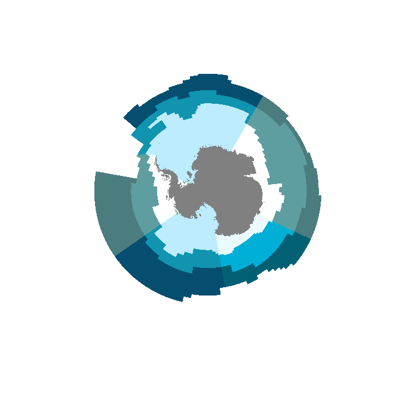
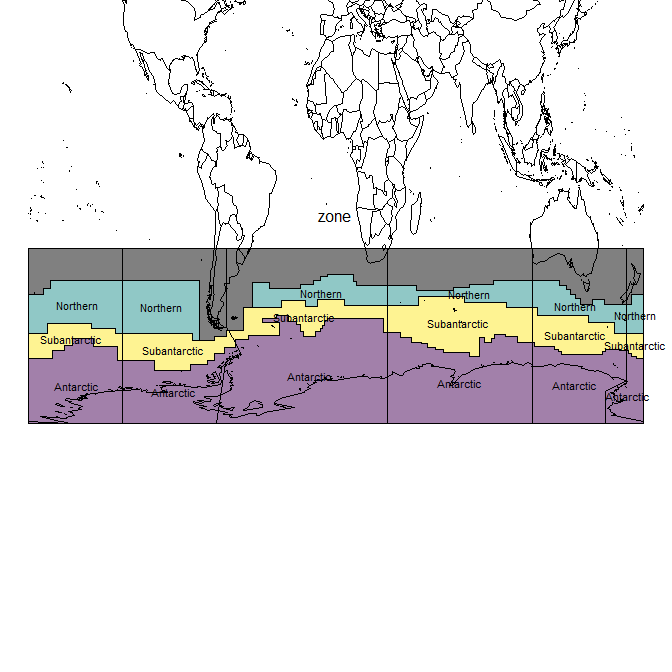

<!-- README.md is generated from README.Rmd. Please edit that file -->

# measoshapes

The goal of measoshapes is to provide regionalization boundaries for
MEASO.

There are several in-built data sets currently at **version 05**. See
below where each is explained.

## Installation

To install measoshapes from Github use

``` r
## install.packages("remotes")
remotes::install_github("AustralianAntarcticDivision/measoshapes")
```

## Map

To map the regions with base plotting (with the [sf
package](https://r-spatial.github.io/sf)).

First join the names and properties to the geometry, we also group the
features so that the seam at the anti-meridian is removed.

``` r
library(measoshapes)
#> Loading required package: sf
#> Linking to GEOS 3.6.1, GDAL 2.2.3, PROJ 4.9.3
library(dplyr)
#> 
#> Attaching package: 'dplyr'
#> The following objects are masked from 'package:stats':
#> 
#>     filter, lag
#> The following objects are masked from 'package:base':
#> 
#>     intersect, setdiff, setequal, union
library(sf)

measo <- measo_regions05 %>% group_by(name) %>% summarize() %>% 
  inner_join(measo_names)
#> Joining, by = "name"
measo
#> Simple feature collection with 24 features and 4 fields
#> geometry type:  POLYGON
#> dimension:      XY
#> bbox:           xmin: -6381686 ymin: -6381694 xmax: 6381694 ymax: 6381694
#> epsg (SRID):    NA
#> proj4string:    +proj=laea +lat_0=-90 +lon_0=0 +x_0=0 +y_0=0 +datum=WGS84 +units=m +no_defs
#> # A tibble: 24 x 5
#>    name                                        geometry sector    zone    fill  
#>    <chr>                                  <POLYGON [m]> <chr>     <chr>   <chr> 
#>  1 AOA   ((-2891647 1737477, -2906527 1746418, -292140~ Atlantic  Antarc~ #BCEC~
#>  2 AON   ((2613013 4525871, 2602873 4508308, 2592725 4~ Atlantic  Northe~ #054e~
#>  3 AOS   ((1842392 3191116, 1832256 3196946, 1822102 3~ Atlantic  Subant~ #1094~
#>  4 AOT   ((-3353009 1723416, -3368360 1722003, -338371~ Atlantic  <NA>    #0000~
#>  5 CIA   ((279139.2 483483.3, 290257.6 502741, 301375.~ CentralI~ Antarc~ #FFFF~
#>  6 CIN   ((2294977 3975017, 2305351 3992985, 2315718 4~ CentralI~ Northe~ #4B7D~
#>  7 CIS   ((1842392 3191116, 1852809 3209160, 1863221 3~ CentralI~ Subant~ #5F9E~
#>  8 CIT   ((2613013 4525871, 2623059 4543271, 2633097 4~ CentralI~ <NA>    #0000~
#>  9 EIA   ((3048452 -1421517, 3044304 -1430378, 3040131~ EastIndi~ Antarc~ #EAFA~
#> 10 EIN   ((4093993 -1909060, 4112624 -1917748, 4131243~ EastIndi~ Northe~ #0160~
#> # ... with 14 more rows
```

Now, plot the geometry with the offical colours and make sure no ‘reset’
so that we can add other layers.

``` r
plot(st_geometry(measo), col = measo$fill, reset = FALSE, border = NA)
```


A very simple coastline data is added.

``` r
coast <- rnaturalearth::ne_countries(scale = "medium", returnclass = "sf") %>% dplyr::filter(sovereignt == "Antarctica")
coast <- st_transform(coast, 
                      st_crs(measo))

plot(st_geometry(measo), col = measo$fill, reset = FALSE, border = NA)
plot(coast, col = "#808080", add = TRUE, border = NA)
#> Warning in plot.sf(coast, col = "#808080", add = TRUE, border = NA): ignoring
#> all but the first attribute
```



## Data sets

There is no code in the measoshapes package, but the package records the
creation of each shapes layer using standard R mechanisms.

There are five datasets, and for normal usage, calculating areas, and
making maps we would use the first three. The `_coastline` forms have
the continent of Antarctica cut out of the shapes.

  - `measonames` a dataframe of the `name`, `sector`, and `zone`
  - `measo_regions05_ll_coastline` the polygons with the continent of
    Antarctica cut out
  - `measo_regions05_coastline` the polygons (in polar) with the
    continent of Antarctica cut out

Two other forms in polar and longitude/latitude form are use for model
overlays (for technical reasons).

  - `measo_regions05` the polygons of each combination of sector and
    zone
  - `measo_regions05_ll` the polygons in longitude/latitude form

To make a map with these we can use the following code

``` r
library(measoshapes)
plot(measo_regions05_ll_coastline, reset = FALSE)
maps::map(add = TRUE, col = "grey", fill = FALSE)
```


To export to shapefile:

``` r
st_write(measo_regions05_ll_coastline, "myfile.shp", driver = "SHP")
```

Here we explore the names in more detail. The northern regions are
assigned codes that include “T” for **temperate**, but they aren’t
supposed to be part of MEASO. They share a sector but have no assigned
zone. From `colour_values` on zone they get black.

``` r
par(mar = rep(0.2, 4))
plot(st_geometry(measo_regions05_ll), reset = FALSE, 
     col = colourvalues::colour_values(measo_names$sector, alpha = 0.5))
cds <- st_coordinates(st_centroid(measo_regions05_ll))
#> Warning in st_centroid.sfc(st_geometry(x), of_largest_polygon =
#> of_largest_polygon): st_centroid does not give correct centroids for longitude/
#> latitude data
text(cds, lab = measo_names$name, cex = 0.7)
par(xpd = NA)
text(0, -20, "name")
maps::map(add = TRUE)
```


``` r
par(xpd = TRUE)

plot(st_geometry(measo_regions05_ll), reset = FALSE, 
     col = colourvalues::colour_values(measo_names$zone, alpha = 0.5))
cds <- st_coordinates(st_centroid(measo_regions05_ll))
#> Warning in st_centroid.sfc(st_geometry(x), of_largest_polygon =
#> of_largest_polygon): st_centroid does not give correct centroids for longitude/
#> latitude data
text(cds, lab = measo_names$zone, cex = 0.7)
par(xpd = NA)
text(0, -20, "zone")
maps::map(add = TRUE)
```



``` r
par(xpd = TRUE)


plot(st_geometry(measo_regions05_ll), reset = FALSE, 
     col = colourvalues::colour_values(measo_names$zone, alpha = 0.5))
cds <- st_coordinates(st_centroid(measo_regions05_ll))
#> Warning in st_centroid.sfc(st_geometry(x), of_largest_polygon =
#> of_largest_polygon): st_centroid does not give correct centroids for longitude/
#> latitude data
text(cds, lab = measo_names$sector, cex = 0.7)
par(xpd = NA)
text(0, -20, "sector")
maps::map(add = TRUE)
```


``` r
par(xpd = TRUE)
```

-----

Please note that the ‘measoshapes’ project is released with a
[Contributor Code of Conduct](CODE_OF_CONDUCT.md). By contributing to
this project, you agree to abide by its terms.
