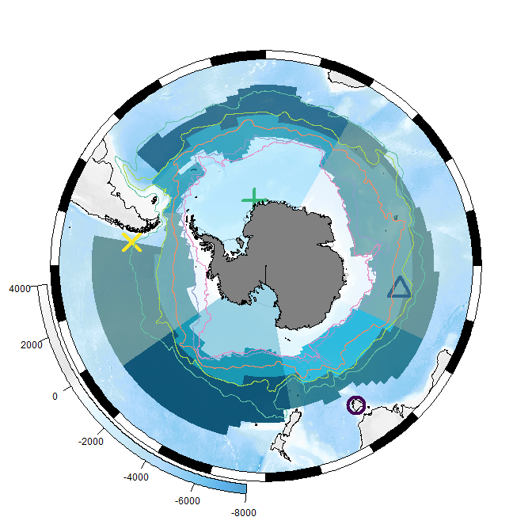
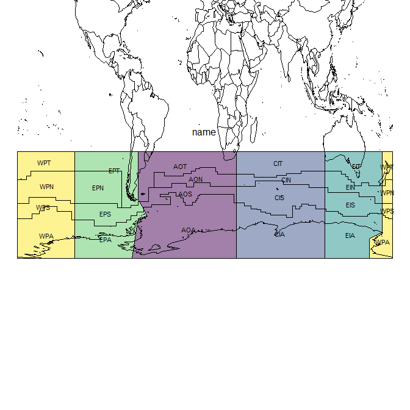

<!-- README.md is generated from README.Rmd. Please edit that file -->

# measoshapes

The goal of measoshapes is to provide regionalization boundaries for
MEASO.

There are several in-built data sets currently at **version 05**. See
below where each is explained.

## Installation

To install measoshapes from Github use

``` r
## install.packages("remotes")
remotes::install_github("AustralianAntarcticDivision/measoshapes")
```

## Map

To map the regions with base plotting (with the [sf
package](https://r-spatial.github.io/sf)).

First join the names and properties to the geometry, we also group the
features so that the seam at the anti-meridian is removed.

``` r
library(measoshapes)
library(dplyr)
library(sf)

measo <- measo_regions05 %>% group_by(name) %>% summarize() %>% 
  inner_join(measo_names)
#> Joining, by = "name"
```

Now, plot the geometry with the offical colours and make sure no ‘reset’
so that we can add other layers.

``` r
plot(st_geometry(measo), col = measo$fill, reset = FALSE, border = NA)
```


A very simple coastline data is added.

``` r
coast <- rnaturalearth::ne_countries(scale = "medium", returnclass = "sf") %>% dplyr::filter(sovereignt == "Antarctica")
coast <- st_transform(coast, 
                      st_crs(measo))

plot(st_geometry(measo), col = measo$fill, reset = FALSE, border = NA)
plot(st_geometry(coast), col = "#808080", add = TRUE, border = NA)
```


## Map with ggplot2

A ggplot2 example. To use the literal fill colours we need
`scale_fill_identity()`, this is ggplot’s “straight-through” mechanism.

``` r

library(ggplot2)
ggplot(measo, aes(fill = fill)) + geom_sf(colour = NA) + scale_fill_identity() + geom_sf(data = coast, aes(fill = NULL))
```


## Map with SOmap

The [SOmap
package](https://github.com/AustralianAntarcticDivision/SOmap) provides
some simpler ways of creating and adding to polar maps. Once a map is
set up it knows what projection it is in, so we can forget about having
to transform the data.

We can add arbitrary data at longitude/latitudes pairs and SOplot knows
what to do.

``` r
## atm we need a special branch (2020-02-20)
#remotes::install_github("AustralianAntarcticDivision/SOmap@dev-0.6")
library(SOmap)
#> Loading required package: raster
#> Loading required package: sp
#> 
#> Attaching package: 'raster'
#> The following object is masked from 'package:dplyr':
#> 
#>     select
SOmap(trim = -32) ## set up a polar map
## set overlay to half-transparent
SOplot(st_geometry(measo), border = NA, col = scales::alpha(measo$fill, 0.5))  ## no need to worry about the projection
#> Warning in if (class(x) == "character") {: the condition has length > 1 and only
#> the first element will be used
#> Warning in if (class(x) != "CRS") {: the condition has length > 1 and only the
#> first element will be used
#> Warning in SOproj(x = x, y = y, target = target, source = source, ...): assuming
#> generic data is in longitude,latitude

ll <- cbind(lon = c(147, 100, -10, -80), 
            lat = c(-42, -50, -70, -50))
SOplot(ll, pch = 1:4, col = viridis::viridis(4), cex = 3, lwd = 4)
#> Warning in SOproj(x = x, y = y, target = target, source = source, ...): assuming
#> generic data is in longitude,latitude
```



## Data sets

There is no code in the measoshapes package, but the package records the
creation of each shapes layer using standard R mechanisms.

There are five datasets, and for normal usage, calculating areas, and
making maps we would use the first three. The `_coastline` forms have
the continent of Antarctica cut out of the shapes.

  - `measonames` a dataframe of the `name`, `sector`, and `zone`
  - `measo_regions05_ll_coastline` the polygons with the continent of
    Antarctica cut out
  - `measo_regions05_coastline` the polygons (in polar) with the
    continent of Antarctica cut out

Two other forms in polar and longitude/latitude form are use for model
overlays (for technical reasons).

  - `measo_regions05` the polygons of each combination of sector and
    zone
  - `measo_regions05_ll` the polygons in longitude/latitude form

To make a map with these we can use the following code

``` r
library(measoshapes)
plot(measo_regions05_ll_coastline, reset = FALSE)
maps::map(add = TRUE, col = "grey", fill = FALSE)
```


To export to shapefile:

``` r
st_write(measo_regions05_ll_coastline, "myfile.shp", driver = "SHP")
```

Here we explore the names in more detail. The northern regions are
assigned codes that include “T” for **temperate**, but they aren’t
supposed to be part of MEASO. They share a sector but have no assigned
zone. From `colour_values` on zone they get black.

``` r
par(mar = rep(0.2, 4))
plot(st_geometry(measo_regions05_ll), reset = FALSE, 
     col = colourvalues::colour_values(measo_names$sector, alpha = 0.5))
cds <- st_coordinates(st_centroid(measo_regions05_ll))
#> Warning in st_centroid.sfc(st_geometry(x), of_largest_polygon =
#> of_largest_polygon): st_centroid does not give correct centroids for longitude/
#> latitude data
text(cds, lab = measo_names$name, cex = 0.7)
par(xpd = NA)
text(0, -20, "name")
maps::map(add = TRUE)
```



``` r
par(xpd = TRUE)

plot(st_geometry(measo_regions05_ll), reset = FALSE, 
     col = colourvalues::colour_values(measo_names$zone, alpha = 0.5))
cds <- st_coordinates(st_centroid(measo_regions05_ll))
#> Warning in st_centroid.sfc(st_geometry(x), of_largest_polygon =
#> of_largest_polygon): st_centroid does not give correct centroids for longitude/
#> latitude data
text(cds, lab = measo_names$zone, cex = 0.7)
par(xpd = NA)
text(0, -20, "zone")
maps::map(add = TRUE)
```


``` r
par(xpd = TRUE)


plot(st_geometry(measo_regions05_ll), reset = FALSE, 
     col = colourvalues::colour_values(measo_names$zone, alpha = 0.5))
cds <- st_coordinates(st_centroid(measo_regions05_ll))
#> Warning in st_centroid.sfc(st_geometry(x), of_largest_polygon =
#> of_largest_polygon): st_centroid does not give correct centroids for longitude/
#> latitude data
text(cds, lab = measo_names$sector, cex = 0.7)
par(xpd = NA)
text(0, -20, "sector")
maps::map(add = TRUE)
```


``` r
par(xpd = TRUE)
```

-----

Please note that the ‘measoshapes’ project is released with a
[Contributor Code of Conduct](CODE_OF_CONDUCT.md). By contributing to
this project, you agree to abide by its terms.
